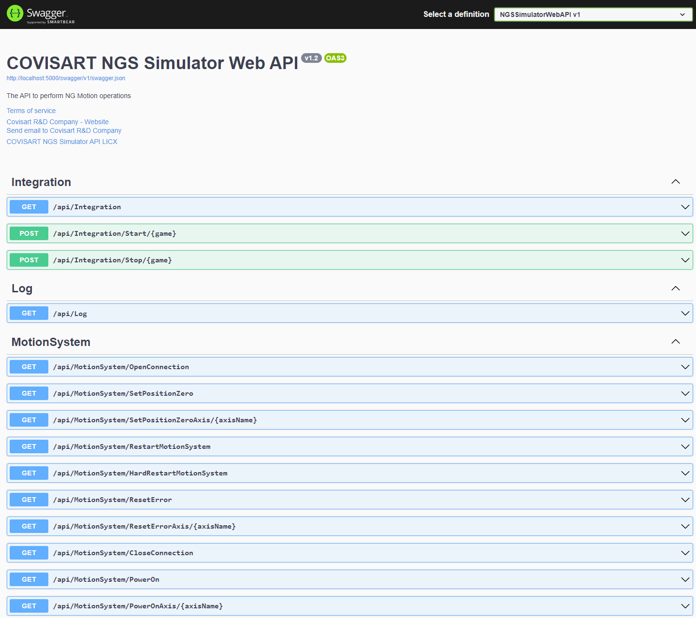

# NGS-360-3 Platform Integration/Connection Example with Qt5

All required system side codes completed. 

You can find Qt5 C++ example code at HurSim folder. 

In Example, used standart QTcpSocket library.

You have to send 3 double value as 24 byte array to system. 

<code>
    double  x, y, z;
    byte data = new byte[24];
    BitConverter.GetBytes(x).CopyTo(data, 0);
    BitConverter.GetBytes(y).CopyTo(data, 8);
    BitConverter.GetBytes(z).CopyTo(data, 16);
</code>

For manual platform control, you can look  [http://localhost:5000/swagger/index.html](http://localhost:5000/swagger/index.html)

