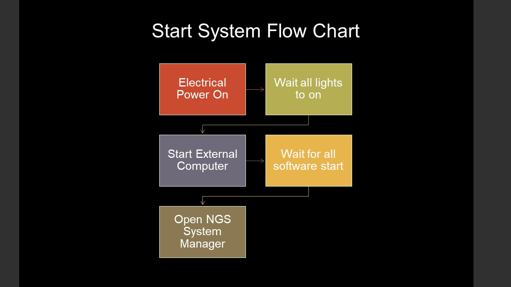
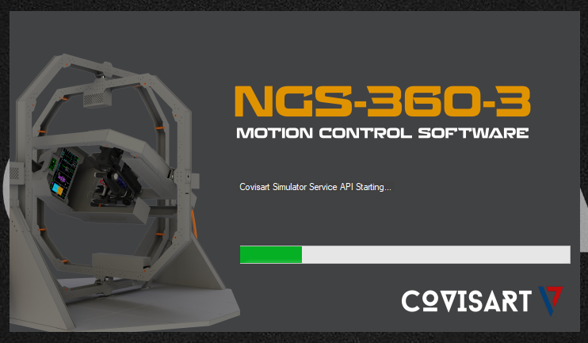
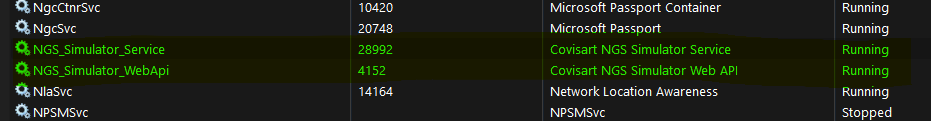
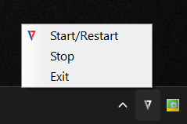
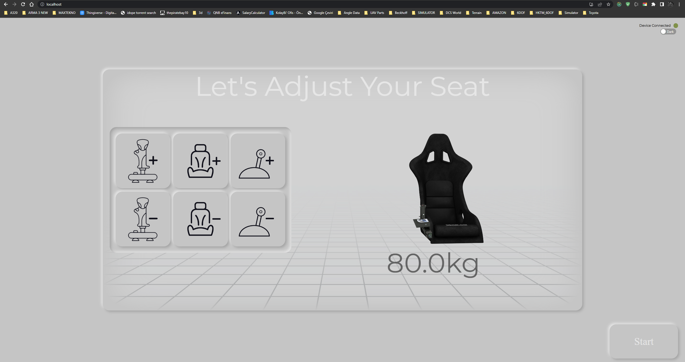
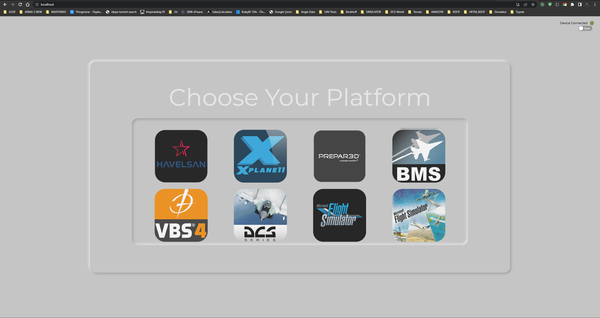
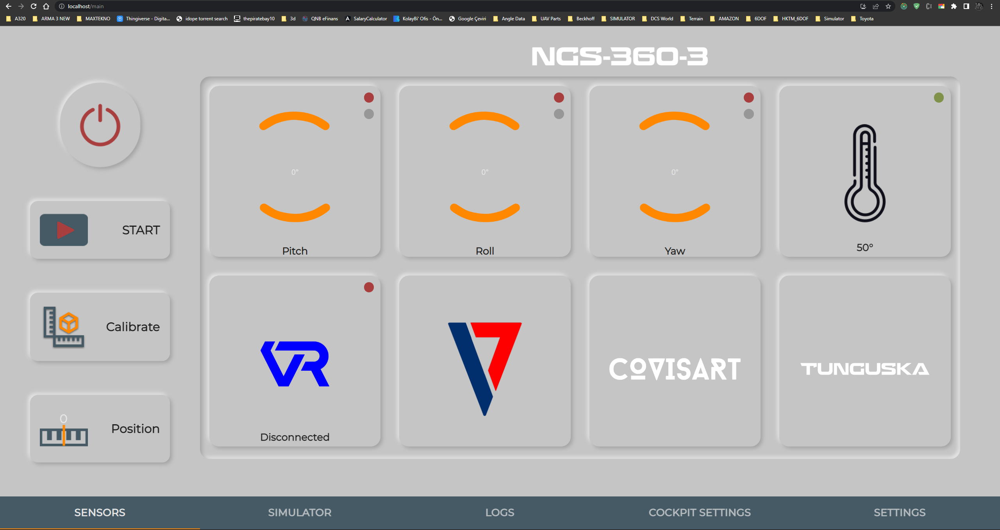
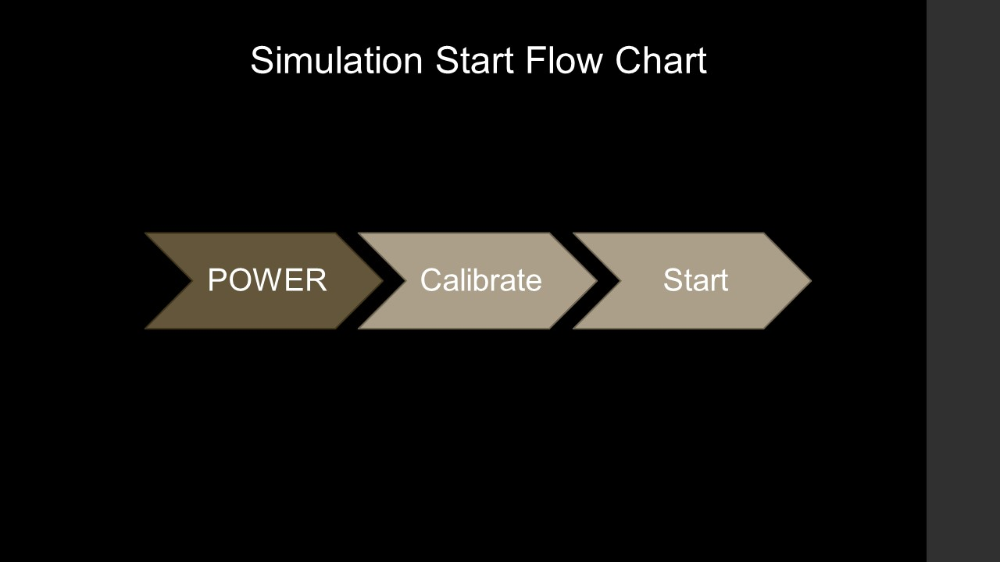
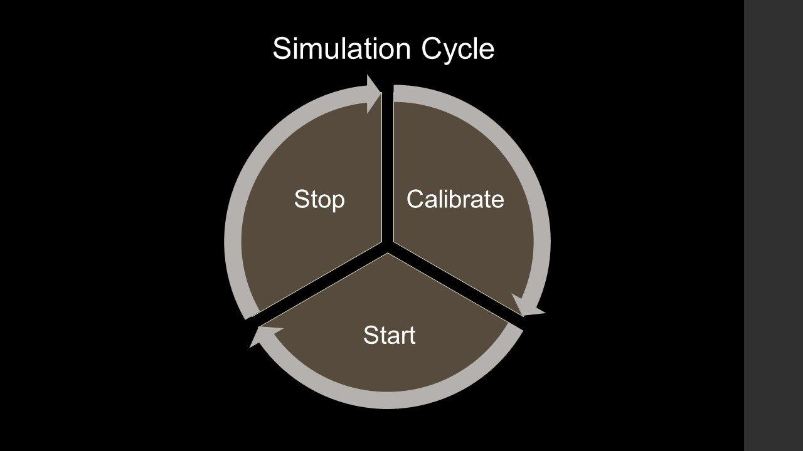

# NGS-360-3 Platform Integration/Connection

| [Features](#features) | [Platform Content](#platform-content) | [Installing](#installing) | [Quick Start](#quick-start) |
|---|---|---|---|

## Features
- Standart TCP/UDP communication
- Modern WebAPI/RestAPI Control
- Cross-Platform Windows/Linux
- Independent from programming language
- C#, C/C++, Python and Java Examples

## Platform Content
- Windows 10 IoT Enterpise LTSC
- Beckhoff TwinCAT 3 PTP Axis 10
- NGS Simulator Service - Motion and Communication system manager service(working on Windows)
- NGS Simulator WebAPI/RestAPI - remote api for NGS Simulator Service([dotnetcore](https://github.com/dotnet/core))
- NGS Web UI - web based platform control UI([React](https://github.com/facebook/react))

## Installing
Motion platform comes with own control computer and all required softwares installed. For development purpose, we provide VirtualBox and VMWare Image of control computer, this images prepared to work without motion platform. Access to image of virtual machine provided when motion platform delivered or all agrement completed

## Quick Start

### Requirments
- Qt5 - Core, Network
- Cmake
### Start Motion Platform

### Start System

Platform software has 3 main component, all of them are installed on computer(virtual machine). When we power up computer, mmotion control envirment(TwinCAT) will startup. 
If you are on developlment envirment, it means that it is not licensed. You can create 7 days license again and again until you complete developlemt. You can do it on TwinCAT XAE(Visual Studio with TwinCAT) [Creating trial licenses manually](https://infosys.beckhoff.com/english.php?content=../content/1033/tc3_licensing/3510308491.html)

If there is no problem, TwinCAT will start on Runtime Mode. Find [NGS System manager]() at Desktop and run it as Administrator.

After Platform Manager software started, it will start all required services for control and integration. 

Chech this two windows service...

If services are not running, find icon of platform manager at right bottom of Windows, right click on over of icon and click Start/Restart.

When all services started, color of icon will change to blue/red, if service are running, color of icon will be gray.  

Now we are ready to control platform and start to develop integration. 

Open your brower and go to this adress. [http://localhost/](http://localhost/). This page is platform control UI. When you first open it will ask configuration, you can just click next. After all complted it will redirect you to [http://localhost/main](http://localhost/main)

Please, be sure what platfor you are using. 

## Main Control Web UI

Button Functions:
- Power - it will power on/off motor, when you power on, you will that red icon on each axis will be green and ready for commands.
- Start - this button start data listener for selected integration/connection(needs powered on)
- Calibrate - after each simulation you have to calibrate system. it means that, system will goes to 0 position(needs powered on)
- Position - sets current position as Home position(do not do it when powered on)

Tabs:

- Sensor - main page and it shows system sensors status
- Simulator - integration selection page and status of integration(connection, input data)
- Logs - system log(mostly error and warnings)
- Cockpit Settings - if system has cockpit, you can find all releated setting on this page
- Setting - basic ip and port settings

# Working Flowchart

# For HurSim integration, open Integration.md [Integration.md](Integration.md)
